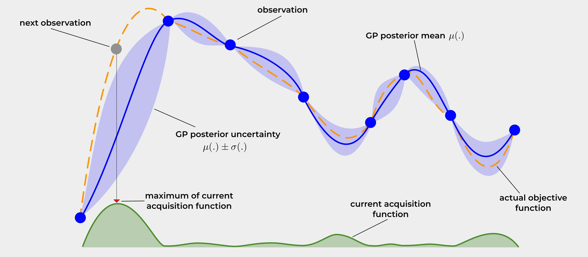

# Finding the Optimal Learning Rate using Bayesian Optimization on K-MNIST in PyTorch

This repository gives a simple *hands-on*  introduction into Bayesian Optimization for learning rate optimization. 
I am training a small ResNet implemented in PyTorch on the Kuzushiji-MNIST (or K-MNIST) dataset.
It is only meant for **educational** purposes! 

### My Blog 
I have also a [blog](https://firasalhafez.com/2021/05/12/finding-the-optimal-learning-rate-using-bayesian-optimization/) 
explaining everything in detail. Also, checkout the [Jupyter notebook](Optimal_Learning_Rate_KMNIST.ipynb), where you'll find the results as well.  

# Installing Requirements

Please install all required packages.

```shell script
pip install -r requirements.txt
```

# Run an Example

Simply run the main script with

```shell script
python main.py
```

Note that it was test on Python 3.8.

